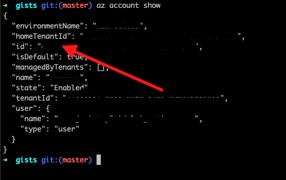
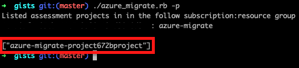
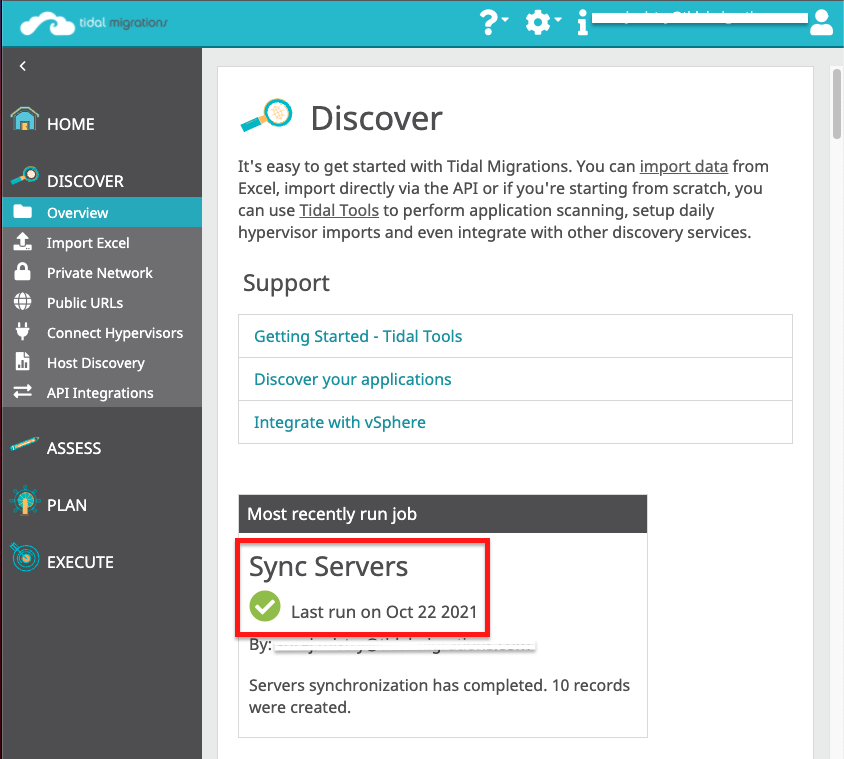

This will walk you through how to integrate Azure Migrate with Tidal. This integration will sync an inventory of servers that are a part of a Project within your Azure Migrate Portal.

## Tutorial

Check out below for a brief video on how to do these steps.

<div>

  <iframe width="560" height="315" src="https://www.youtube.com/embed/_ERzDACKWgw" title="YouTube video player" frameborder="0" allow="accelerometer; autoplay; clipboard-write; encrypted-media; gyroscope; picture-in-picture" allowfullscreen></iframe>

</div>

## Run the integration

### Installation requirements

- Azure Migrate script from [Tidal Gists Repository](https://github.com/tidalmigrations/gists).

  - If `git` is configured, clone the repository with:

    `git clone https://github.com/tidalmigrations/gists.git`

  - Alternatively you can download a copy of the latest file directly from [a browser](https://github.com/tidalmigrations/gists/archive/refs/heads/master.zip).

- [Azure Command-Line Interface](https://docs.microsoft.com/en-us/cli/azure/) (az-cli)
- [Tidal Tools](https://get.tidal.sh/).

### Authenticate

Login to Azure with the `az` CLI.

- Run `az login` and confirm the target subscription is present with `az account show`. See image below to find the `id` of the correct target subscription.

  

- Set the default subscription with `az account set --subscription <SUBSCRIPTION_ID>`

### Configure environment

Next, configure four environment variables used by the integration to connect to your Azure subscription.

- In the Azure Portal, find the Azure subscription and resource group that the Azure Migrate Project Assessment are located in. Set the `AZ_MIGRATE_SUBSCRIPTION` variable with the subscription ID and the `AZ_MIGRATE_RG` variable with the resource group name.
  Set `AZURE_TOKEN` variable with this command:

```
export AZURE_TOKEN=$(az account get-access-token --query accessToken --output tsv)
```

Run `./azure_migrate.rb -p` and you should see a list of all the Projects in the set subscription and resource group. See image below

- Export this internal project name as `AZ_MIGRATE_PROJECT`



In summary the 4 variables to set are:

```
export AZ_MIGRATE_SUBSCRIPTION= <SUBSCRIPTION_ID>

export AZ_MIGRATE_RG= <RESOURCE_GROUP>

export AZURE_TOKEN=$(az account get-access-token --query accessToken --output tsv)

export AZ_MIGRATE_PROJECT= <ASSESSMENT_PROJECT_MACHINE_NAME>
```

### Execute

Once your environment variables are configured, log in to Tidal Migration Platform using `tidal login` and authenticate with your Tidal Workspace URL, email and password.

Change directory into the `gists` repository

```
cd ./gists
```

Execute the Azure Migrate export and pipe the servers into Tidal Tools using `sync servers`

```
./azure_migrate.rb | tidal sync servers
```

---
**NOTE:** 
The `azure_migrate.rb` script will collect the following data points.
- host_name
- ip_address
- description
- ram_allocated_gb
- storage_allocated_gb
- cpu_count
- virtualization_cluster
- discovery_machine_arm_id
- operating_system_name
- operating_system_type
- operating_system_version
- first_seen (createdTimestamp) 
- last_seen (updatedTimestamp)

---

### Review

Once the command succeeds you can navigate to your Tidal Workspace URL to see the results. Use the left menu bar to navigate to `Discover > Overview` where the “Most recently run job” card should say `Sync Servers` and have the same timestamp as when the sync servers command suceeded.
This means that `tidal sync servers` successfully updated your server inventory, as seen in the image below.



View the imported servers that have been from Azure Migrate to this Tidal workspace in the left menu under `Assess > Servers`. Select an imported server and some compute, virtualization and networking parameters have be pre-populated based on the data in Azure Migrate that was imported into this Tidal workspace.
